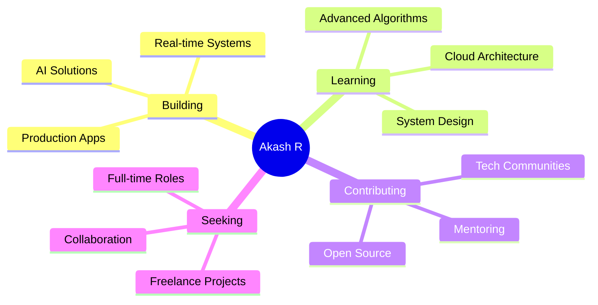

<div align="center">
  
</div>

<div align="center">
  
  [](https://akashr-io.vercel.app/)
  [](https://www.linkedin.com/in/aaakashrajendran)
  [](mailto:aakashrajendran2004@gmail.com)
  [](https://github.com/Akashrrrrd)
  
  
  
</div>

<br/>

<div align="center">
  
</div>

<br/>

## 🎯 Professional Summary

```typescript
const akash = {
    role: "Full Stack Developer",
    education: "BE in ECE @ Chennai Institute of Technology",
    gpa: "8.2/10",
    location: "Chennai, India",
    
    achievements: {
        hackathons: ["DocuSign Winner ($100)", "SIH Finalist", "Google Chrome AI Finalist"],
        freelancing: "₹20,000 E-Learning Platform",
        leadership: "Head of Web Dev - 2000+ registrations managed"
    },
    
    currentFocus: ["Building Production-Ready Apps", "AI Integration", "System Design"],
    openTo: ["Full-time Opportunities", "Freelance Projects", "Open Source Collaboration"]
};
```

<br/>

## �️ Techntology Arsenal

<div align="center">

### Languages


### Frontend Development


### Backend Development


### Databases


### Tools & Platforms


</div>

<br/>

## 🚀 Featured Projects

<div align="center">

<table>
<tr>
<td width="50%">

### 🎯 [MailSense](https://mailsense-omega.vercel.app/)
**Smart Email Assistant with AI**

  

✨ **Key Features:**
- 🔐 Google OAuth authentication
- 🤖 AI-powered email classification
- 📱 WhatsApp notifications via Twilio
- ⚡ Real-time Gmail API integration

**Impact:** Automated email management with complete privacy

</td>
<td width="50%">

### ⚡ [SyncOps](https://sync-ops-xvfz.vercel.app/)
**Real-time Collaboration Platform**

  

✨ **Key Features:**
- ⚡ Sub-100ms data processing
- 📊 Handles 100+ concurrent streams
- 🔄 Asynchronous I/O operations
- 📈 40% efficiency improvement

**Impact:** High-performance real-time data pipelines

</td>
</tr>

<tr>
<td width="50%">

### 🌾 [AgroConnect](https://agro-connect-luet.vercel.app/)
**Farm-to-Consumer E-Commerce**

  

✨ **Key Features:**
- 🗺️ Geolocation-based marketplace
- 🤖 Gemini AI chatbot assistant
- 🔥 Firebase & Firestore backend
- 📱 Mobile-responsive design

**Impact:** Direct farmer-consumer connection platform

</td>
<td width="50%">

### 📚 [OpenPrep](https://open-prepio.vercel.app/)
**Placement Preparation Hub**

  

✨ **Key Features:**
- 📖 Company-specific resources
- 💻 Structured coding paths
- 👥 1,500+ active learners
- 🔄 Real-time content updates

**Impact:** Comprehensive interview prep platform

</td>
</tr>
</table>

</div>

<br/>

## 🏆 Achievements & Recognition

<div align="center">

| 🎯 Achievement | 📊 Impact | 💡 Recognition |
|:--------------|:----------|:---------------|
| 🥇 **DocuSign Hackathon Winner** | Most Valuable Project | **$100 Prize** |
| 🏅 **Smart India Hackathon** | National Level Competition | **Finalist** |
| 🎖️ **Google Chrome AI Challenge** | Scalable AI Solution | **Finalist** |
| 🤖 **Nosu AI Hackathon** | AI-Driven Innovation | **Special Recognition** |
| 💼 **Freelance Success** | Production E-Learning Platform | **₹20,000 Earned** |
| 👨‍💻 **Leadership** | Vidyutrenz Symposium | **2,000+ Registrations** |

</div>

<br/>

## 📊 GitHub Analytics

<div align="center">
  
  
</div>

<div align="center">
  
  
</div>

<br/>

## 💼 Professional Experience

<details open>
<summary><b>🚀 Full Stack Developer Intern @ PrepInsta</b> <i>(Jun 2024 - Aug 2024)</i></summary>
<br/>

```yaml
Role: Backend Development & API Optimization
Technologies: Node.js, Express.js, MongoDB, SQL

Key Contributions:
  - Built and optimized backend modules with REST APIs
  - Improved SQL query performance through optimization
  - Implemented secure OAuth authentication systems
  - Maintained near-zero downtime during active development
  - Automated data workflows with Python scripts

Impact: Enhanced system performance and reliability
```

</details>

<details>
<summary><b>💻 Web Developer Intern @ CodeBind Technologies</b> <i>(Nov 2023 - Dec 2023)</i></summary>
<br/>

```yaml
Role: Full Stack Development & Database Design
Technologies: PostgreSQL, MongoDB, Python, React

Key Contributions:
  - Designed and developed Online Ticket Booking Platform
  - Implemented secure CRUD operations with PostgreSQL
  - Optimized database queries using indexing strategies
  - Automated daily tasks with Python scripts
  - Managed dual database architecture (SQL + NoSQL)

Impact: Improved workflow efficiency and data handling
```

</details>

<br/>

## 🎓 Certifications & Learning

<div align="center">

| Certification | Issuer | Focus Area |
|:-------------|:-------|:-----------|
| 🤖 **Digital Skills: AI** | Accenture (FutureLearn) | AI Fundamentals & Applications |
| 🔒 **Networks & Security** | Cisco | Networking & Security Protocols |
| 🍃 **MongoDB for Developers** | MongoDB University | Database Design & Optimization |

</div>

<br/>

## 🎯 What I'm Up To

<div align="center">



</div>

<br/>

## 🤝 Let's Connect & Collaborate

<div align="center">

### 💬 Open to Opportunities

I'm actively seeking **Full-time Software Development roles** and **exciting freelance projects**. 
If you're looking for someone who can deliver production-ready solutions with clean code and scalability in mind, let's talk!

<br/>

[](https://akashr-io.vercel.app/)
[](https://www.linkedin.com/in/aaakashrajendran)
[](mailto:aakashrajendran2004@gmail.com)

<br/>

### 📫 Quick Contact

```javascript
const contact = {
    email: "aakashrajendran2004@gmail.com",
    phone: "+91 9655667171",
    portfolio: "akashr-io.vercel.app",
    linkedin: "linkedin.com/in/aaakashrajendran",
    location: "Chennai, India",
    availability: "Immediate"
};
```

<br/>

---


<br/>

**⭐ If you find my work interesting, consider starring my repositories!**

<sub>💡 *"Code is like humor. When you have to explain it, it's bad."* – Cory House</sub>

</div>
