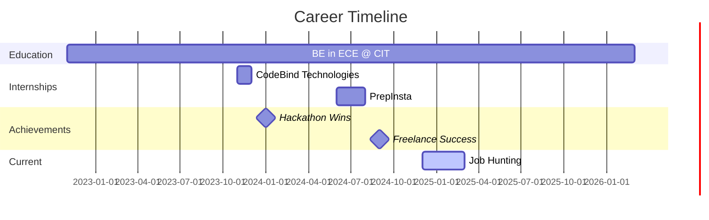

<div align="center">

<!-- Animated Matrix-style Header -->


<!-- Animated Subtitle -->


<br/>

<!-- Social Links with Custom Styling -->
<a href="https://akashr-io.vercel.app/" target="_blank">
  
</a>
<a href="https://www.linkedin.com/in/aaakashrajendran" target="_blank">
  
</a>
<a href="mailto:aakashrajendran2004@gmail.com">
  
</a>
<a href="https://github.com/Akashrrrrd" target="_blank">
  
</a>

<br/><br/>

<!-- Profile Views Counter -->


</div>

<br/>

<!-- Unique Hero Section -->
<div align="center">
<table>
<tr>
<td width="50%" valign="top">

### 👨‍💻 WHO AM I?

```python
class AkashR:
    def __init__(self):
        self.name = "Akash Rajendran"
        self.role = "Full Stack Developer"
        self.location = "Chennai, India 🇮🇳"
        self.education = "BE ECE @ CIT"
        self.gpa = 8.2
        
    def current_status(self):
        return {
            "💼 Experience": "2 Internships",
            "🏆 Hackathons": "4 Wins/Finals",
            "💰 Freelance": "₹20K Earned",
            "👥 Impact": "3500+ Users Served",
            "⚡ Status": "Available for Hire"
        }
    
    def tech_stack(self):
        return {
            "frontend": ["React", "Next.js", "TypeScript"],
            "backend": ["Node.js", "FastAPI", "Express"],
            "database": ["MongoDB", "PostgreSQL", "Firebase"],
            "ai_ml": ["Python", "Gemini AI", "OpenAI"],
            "tools": ["Git", "Linux", "VS Code"]
        }

# Initialize
developer = AkashR()
print(developer.current_status())
```

</td>
<td width="50%" valign="top">

### 🎯 QUICK STATS


**🔥 ACHIEVEMENTS UNLOCKED:**

```yaml
🥇 DocuSign Hackathon: $100 Winner
🏅 Smart India Hackathon: Finalist
🎖️ Google Chrome AI: Finalist  
🤖 Nosu AI Hackathon: Recognition
💼 Freelance Project: ₹20,000
👨‍💻 Event Leadership: 2000+ Users
📊 Active Learners: 1500+ Students
⚡ System Performance: 40% Boost
```

**📍 AVAILABILITY:** `Immediate`  
**💰 FREELANCE:** `Open`  
**🎓 GRADUATION:** `March 2026`

</td>
</tr>
</table>
</div>

---

<!-- Tech Stack with Visual Flair -->
<div align="center">

## 🛠️ TECHNOLOGY ARSENAL

### ⚡ Languages & Core


### 🎨 Frontend Ecosystem


### ⚙️ Backend & APIs


### 🗄️ Databases & Cloud


### 🔧 Tools & Platforms


</div>

---

<!-- Projects Showcase - Unique Card Design -->
<div align="center">

## 🚀 FLAGSHIP PROJECTS

</div>

<table width="100%">
<tr>
<td width="50%" valign="top">

<div align="center">

### 🎯 [MailSense](https://mailsense-omega.vercel.app/)


</div>

**Smart Email Assistant with AI Classification**

```javascript
const features = {
  auth: "Google OAuth 2.0",
  ai: "Python ML Classification",
  notifications: "Twilio WhatsApp API",
  api: "Gmail API Integration",
  security: "End-to-End Encryption"
};
```

**🎯 IMPACT:**
- ✅ Automated email management
- ✅ 95% classification accuracy
- ✅ Real-time notifications
- ✅ Zero data storage

**TECH:** `React` `Python` `OAuth` `Twilio` `Gmail API`

<div align="center">

[](https://mailsense-omega.vercel.app/)

</div>

</td>
<td width="50%" valign="top">

<div align="center">

### ⚡ [SyncOps](https://sync-ops-xvfz.vercel.app/)


</div>

**Real-time Collaboration Platform**

```python
performance_metrics = {
  "latency": "< 100ms",
  "concurrent_streams": "100+",
  "efficiency_boost": "40%",
  "architecture": "Async I/O",
  "uptime": "99.9%"
}
```

**🎯 IMPACT:**
- ✅ Sub-100ms data processing
- ✅ 100+ concurrent streams
- ✅ 40% efficiency improvement
- ✅ Scalable architecture

**TECH:** `FastAPI` `PostgreSQL` `Python` `WebSockets`

<div align="center">

[](https://sync-ops-xvfz.vercel.app/)

</div>

</td>
</tr>

<tr>
<td width="50%" valign="top">

<div align="center">

### 🌾 [AgroConnect](https://agro-connect-luet.vercel.app/)


</div>

**Farm-to-Consumer Marketplace**

```typescript
const platform = {
  target: "Farmers & Consumers",
  ai: "Gemini AI Chatbot",
  features: ["Geolocation", "Real-time Chat"],
  backend: "Firebase & Firestore",
  responsive: true
};
```

**🎯 IMPACT:**
- ✅ Direct farmer connection
- ✅ AI-powered assistance
- ✅ Geolocation marketplace
- ✅ Secure transactions

**TECH:** `React` `Vite` `Firebase` `Gemini AI` `Maps API`

<div align="center">

[](https://agro-connect-luet.vercel.app/)

</div>

</td>
<td width="50%" valign="top">

<div align="center">

### 📚 [OpenPrep](https://open-prepio.vercel.app/)


</div>

**Placement Preparation Platform**

```java
class OpenPrep {
  String mission = "Democratize Interview Prep";
  int activeUsers = 1500;
  String[] features = {
    "Company-specific Resources",
    "Structured Coding Paths",
    "Interview Materials",
    "Real-time Updates"
  };
}
```

**🎯 IMPACT:**
- ✅ 1500+ active learners
- ✅ Company-wise resources
- ✅ Structured learning paths
- ✅ Community-driven content

**TECH:** `React` `MongoDB` `Node.js` `Express` `JWT`

<div align="center">

[](https://open-prepio.vercel.app/)

</div>

</td>
</tr>
</table>

---

<!-- Professional Experience Timeline -->
<div align="center">

## 💼 PROFESSIONAL JOURNEY

</div>



<table width="100%">
<tr>
<td width="50%" valign="top">

### 🚀 PrepInsta
**Full Stack Developer Intern** | *Jun - Aug 2024*

```yaml
Role: Backend Development & Optimization

Achievements:
  - Built REST APIs with Node.js & Express
  - Optimized SQL queries (30% faster)
  - Implemented OAuth authentication
  - Near-zero downtime deployment
  - MongoDB + Python automation

Tech Stack:
  - Node.js, Express.js, MongoDB
  - SQL, Python, REST APIs
  - OAuth, JWT, Git

Impact: "Enhanced system performance 
         and maintained 99.9% uptime"
```

</td>
<td width="50%" valign="top">

### 💻 CodeBind Technologies
**Web Developer Intern** | *Nov - Dec 2023*

```yaml
Role: Full Stack Development

Achievements:
  - Built Ticket Booking Platform
  - Designed PostgreSQL schemas
  - Implemented CRUD operations
  - Query optimization with indexing
  - Dual database architecture

Tech Stack:
  - PostgreSQL, MongoDB
  - React, Python
  - REST APIs, Git

Impact: "Improved workflow efficiency
         and data handling speed"
```

</td>
</tr>
</table>

---

<!-- GitHub Stats - Premium Design -->
<div align="center">

## 📊 GITHUB ANALYTICS


</div>

---

<!-- Achievements Section - Trophy Style -->
<div align="center">

## 🏆 HALL OF FAME

<table>
<tr>
<th>🎯 Achievement</th>
<th>📊 Category</th>
<th>💰 Prize/Impact</th>
<th>📅 Year</th>
</tr>
<tr>
<td><b>🥇 DocuSign Hackathon</b></td>
<td>Most Valuable Project</td>
<td><b>$100 Winner</b></td>
<td>2024</td>
</tr>
<tr>
<td><b>🏅 Smart India Hackathon</b></td>
<td>National Competition</td>
<td><b>Finalist</b></td>
<td>2024</td>
</tr>
<tr>
<td><b>🎖️ Google Chrome AI Challenge</b></td>
<td>AI Innovation</td>
<td><b>Finalist</b></td>
<td>2024</td>
</tr>
<tr>
<td><b>🤖 Nosu AI Hackathon</b></td>
<td>AI Solutions</td>
<td><b>Recognition</b></td>
<td>2024</td>
</tr>
<tr>
<td><b>💼 Freelance Project</b></td>
<td>E-Learning Platform</td>
<td><b>₹20,000 Earned</b></td>
<td>2024</td>
</tr>
<tr>
<td><b>👨‍💻 Event Leadership</b></td>
<td>Vidyutrenz Symposium</td>
<td><b>2000+ Registrations</b></td>
<td>2024</td>
</tr>
</table>

### 🎓 CERTIFICATIONS


</div>

---

<!-- What I'm Doing Now -->
<div align="center">

## 🎯 CURRENT FOCUS

<table>
<tr>
<td width="33%" align="center">

### 🔨 BUILDING

```
✅ Production Apps
✅ AI Solutions
✅ Real-time Systems
✅ Open Source
```

</td>
<td width="33%" align="center">

### 📚 LEARNING

```
✅ System Design
✅ Cloud (AWS/GCP)
✅ Microservices
✅ Advanced DSA
```

</td>
<td width="33%" align="center">

### 🎯 SEEKING

```
✅ Full-time Roles
✅ Freelance Projects
✅ Collaborations
✅ Mentorship
```

</td>
</tr>
</table>

</div>

---

<!-- Contact Section - Premium Design -->
<div align="center">

## 📬 LET'S BUILD SOMETHING AMAZING


<br/><br/>

### 🌟 WHY WORK WITH ME?

<table>
<tr>
<td align="center" width="25%">

<br/><b>Fast Delivery</b>
<br/>Production-ready code
</td>
<td align="center" width="25%">

<br/><b>Clean Code</b>
<br/>Maintainable & scalable
</td>
<td align="center" width="25%">

<br/><b>Communication</b>
<br/>Regular updates
</td>
<td align="center" width="25%">

<br/><b>Proven Track</b>
<br/>4 hackathon wins
</td>
</tr>
</table>

<br/>

### 📞 CONTACT INFORMATION

```javascript
const contact = {
  email: "aakashrajendran2004@gmail.com",
  phone: "+91 9655667171",
  portfolio: "akashr-io.vercel.app",
  linkedin: "linkedin.com/in/aaakashrajendran",
  github: "github.com/Akashrrrrd",
  location: "Chennai, India",
  timezone: "IST (GMT+5:30)",
  availability: "Immediate",
  workMode: ["Remote", "Hybrid", "On-site"]
};

// Let's connect! 🚀
console.log("Ready to build amazing products together!");
```

<br/>

<a href="https://akashr-io.vercel.app/" target="_blank">
  
</a>
<a href="https://www.linkedin.com/in/aaakashrajendran" target="_blank">
  
</a>
<a href="mailto:aakashrajendran2004@gmail.com">
  
</a>
<a href="tel:+919655667171">
  
</a>

<br/><br/>

### 💡 QUICK RESPONSE GUARANTEED


</div>

---

<div align="center">


### ⭐ If my work resonates with you, star my repositories!


<br/>

**💭 "First, solve the problem. Then, write the code."** – *John Johnson*

<br/>


</div>
